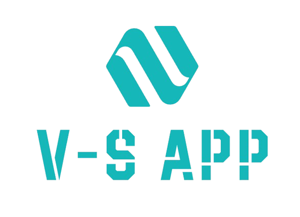

<a id="readme-top"></a>

<!-- PROJECT SHIELDS -->

[![LinkedIn][linkedin-shield]][linkedin-url]

<!-- PROJECT LOGO -->
<br />
<div align="center">
  <a>
    
  </a>

  <h3 align="center">Viceri SEIDOR Application</h3>

  <p align="center">
    Uma aplicação Full Stack para gerenciamento de tarefas, com foco em simplicidade e eficiência.
    <br />
    <a href="https://github.com/EduardoMarques-Dev/viceri-seidor">Repositório</a>
    ·
    <a href="https://github.com/EduardoMarques-Dev/viceri-seidor/issues">Reportar Bug</a>
    ·
    <a href="https://github.com/EduardoMarques-Dev/viceri-seidor/issues">Solicitar Funcionalidade</a>
  </p>
</div>

<!-- TABLE OF CONTENTS -->
<details>
  <summary>Tabela de Conteúdo</summary>
  <ol>
    <li>
      <a href="#sobre-o-projeto">Sobre o Projeto</a>
      <ul>
        <li><a href="#construído-com">Construído com</a></li>
      </ul>
    </li>
    <li>
      <a href="#começando">Começando</a>
      <ul>
        <li><a href="#pré-requisitos">Pré-requisitos</a></li>
        <li><a href="#instalação">Instalação</a></li>
      </ul>
    </li>
    <li><a href="#uso">Uso</a></li>
    <li><a href="#roteiro">Roteiro</a></li>
    <li><a href="#contribuindo">Contribuindo</a></li>
    <li><a href="#licença">Licença</a></li>
    <li><a href="#contato">Contato</a></li>
    <li><a href="#agradecimentos">Agradecimentos</a></li>
  </ol>
</details>

<!-- ABOUT THE PROJECT -->

## Sobre o Projeto

Este projeto é uma aplicação Full Stack desenvolvida para facilitar o gerenciamento de tarefas do dia a dia. O backend é construído com **NestJS** e **TypeScript**, utilizando **Prisma ORM** para a interação com o banco de dados **MongoDB**. O frontend é desenvolvido em **Angular 12**, proporcionando uma interface de usuário moderna e responsiva. O código foi escrito com foco na qualidade e nas boas práticas, com testes unitários implementados usando **Jest**.

Aqui estão algumas razões para considerar este projeto:

- **Eficiência**: A aplicação é rápida e fácil de usar, permitindo que você se concentre nas tarefas que realmente importam.
- **Segurança**: As senhas dos usuários são armazenadas de forma segura utilizando hashing.
- **Documentação Completa**: A API é totalmente documentada com **Swagger**, facilitando a integração e o desenvolvimento.

<p align="right">(<a href="#readme-top">voltar ao topo</a>)</p>

### Construído com

Este projeto foi construído utilizando as seguintes tecnologias e frameworks principais:

- [![NestJS][NestJS-shield]][NestJS-url]
- [![TypeScript][TypeScript-shield]][TypeScript-url]
- [![Prisma][Prisma-shield]][Prisma-url]
- [![MongoDB][MongoDB-shield]][MongoDB-url]
- [![Angular][Angular-shield]][Angular-url]
- [![Bootstrap][Bootstrap-shield]][Bootstrap-url]

<p align="right">(<a href="#readme-top">voltar ao topo</a>)</p>

<!-- GETTING STARTED -->

## Começando

Para obter uma cópia local em funcionamento, siga estas etapas simples.

### Pré-requisitos

Antes de começar, certifique-se de ter as seguintes ferramentas instaladas em sua máquina:

- **npm** (Node Package Manager) - usado para instalar as dependências do projeto.
  ```sh
  npm install npm@latest -g
  ```
- **Angular CLI** - ferramenta de linha de comando para gerenciar o frontend Angular.
  ```sh
  npm install -g @angular/cli
  ```
- **Prisma CLI** - usada para gerenciar migrações e outras operações do Prisma ORM.
  ```sh
  npm install -g prisma
  ```
- **Node.js** (versão 14 ou superior) - necessário para executar o backend.
  - [Baixar Node.js](https://nodejs.org/)
- **Postman** - ferramenta para testar APIs REST, útil para validar as requisições e respostas do backend.
  - [Baixar Postman](https://www.postman.com/downloads/)
- **NoSQLBooster** (opcional) - ferramenta GUI para visualizar e gerenciar o banco de dados MongoDB remotamente.
  - [Baixar NoSQLBooster](https://nosqlbooster.com/downloads)

Com essas ferramentas instaladas, você estará pronto para seguir com a instalação e configuração do projeto.

<p align="right">(<a href="#readme-top">voltar ao topo</a>)</p>

### Instalação e Inicialização

1. Clone o repositório
   ```sh
   git clone https://github.com/EduardoMarques-Dev/viceri-seidor
   cd viceri-seidor
   ```
2. Instale as dependências do backend
   ```sh
   cd backend
   npm install
   ```
3. Sincronize o esquema do Prisma com o banco de dados MongoDB
   ```sh
   npx prisma db push
   ```
4. Atualize o banco de dados utilizando o mongo-migrate
   ```sh
   npx prisma mongo-migrate up
   ```
5. Inicie o servidor do backend
   ```sh
   npm run start
   ```
6. Instale as dependências do frontend
   ```sh
   cd ../frontend
   npm install
   ```
7. Inicie o servidor de desenvolvimento do frontend
   ```sh
   ng serve
   ```

<p align="right">(<a href="#readme-top">voltar ao topo</a>)</p>

<!-- USAGE EXAMPLES -->

## Uso

Após iniciar o servidor, você pode acessar a aplicação através de `http://localhost:4200`. A documentação da API está disponível na rota `/api-docs` do backend, onde você pode explorar as funcionalidades disponíveis.
Também é possível utilizar a coleção do Postman que está na raiz do repositório, que já possui alguns scripts embutidos para testar o projeto.

<p align="right">(<a href="#readme-top">voltar ao topo</a>)</p>

<!-- ROADMAP -->

## Funcionalidades

### Básicas

- [x] **Cadastro de Usuário**: A API permite o cadastro de novos usuários recebendo nome, e-mail e senha. A senha é armazenada de forma segura, utilizando hash, e um ID é gerado automaticamente. Não é permitido criar dois usuários com o mesmo e-mail.
- [x] **Autenticação de Usuário**: O usuário pode se autenticar através do e-mail e senha cadastrados. Após a verificação das credenciais, um token JWT é gerado para autenticação.
- [x] **Inclusão de Tarefas**: Usuários autenticados podem adicionar novas tarefas fornecendo a descrição e a prioridade (Alta, Média, Baixa). A identificação do usuário é obtida através do token de acesso, e um ID é gerado automaticamente para a tarefa.
- [x] **Listagem de Tarefas Pendentes**: A API permite que o usuário autenticado veja a lista de suas tarefas pendentes, identificadas pelo token de autenticação.
- [x] **Segurança**: A API não permite acesso a nenhuma funcionalidade sem autenticação, exceto as operações de login e cadastro.
- [x] **Documentação da API**: A API é totalmente documentada utilizando Swagger, facilitando a compreensão e integração.

### Extras

- [x] **Backend - CRUD de Usuários**: Implementação completa das operações de criação, exclusão, atualização e leitura para gerenciar usuários no sistema.
- [x] **Backend - CRUD de Tarefas**: Implementação completa das operações de criação, exclusão, atualização e leitura para gerenciar tarefas no sistema.
- [x] **Backend - Validação de Campos**: Aplicação de regras personalizadas para validação de campos, incluindo a geração de senhas seguras, validação de e-mails, e outras propriedades essenciais.
- [x] **Backend - Paginação**: Suporte à paginação nos endpoints de consulta de coleções, utilizando parâmetros de query como `skip`, `page` e `take` para controlar a exibição dos resultados.
- [x] **Backend - Decorator Personalizado de Consulta**: Decorator que permite definir quais informações devem ser carregadas para uma entidade específica em determinados endpoints, otimizando a performance das consultas.
- [x] **Backend - Decorator Personalizado de Criptografia**: Decorator que define quais campos de uma entidade serão criptografados, suportando diferentes métodos de criptografia, como HASH ou AES.
- [x] **Backend - Decorator de Exclusão em Cascata**: Decorator que automatiza a exclusão em cascata de entidades logicamente relacionadas, garantindo a integridade dos dados.
- [x] **Backend - Manipulador de Exceções**: Implementação de um manipulador centralizado de exceções, garantindo que erros sejam capturados e tratados de forma consistente e amigável.
- [x] **Frontend - Tela de Exibição de Usuários**: Interface dedicada para listar todos os usuários cadastrados, exibindo informações essenciais de cada usuário de forma clara e organizada.

<p align="right">(<a href="#readme-top">voltar ao topo</a>)</p>

<!-- AWS -->

### Deploy na AWS

Para disponibilizar esta aplicação na AWS utilizando a versão gratuita, siga os passos abaixo:

1. **Backend**:

   - Utilize **AWS Elastic Beanstalk** para fazer o deploy do backend:
     1. Crie um ambiente no Elastic Beanstalk.
     2. Configure as variáveis de ambiente, como as chaves de acesso ao MongoDB.
     3. Faça o upload do código e inicie o ambiente.
   - Configure o banco de dados utilizando **MongoDB Atlas** (versão gratuita).

2. **Frontend**:

   - Utilize **AWS S3** para hospedar o frontend como um site estático:
     1. Compile o frontend com `ng build --prod`.
     2. Faça o upload dos arquivos gerados para um bucket S3 configurado para hospedagem de site estático.
   - Distribua o conteúdo usando **AWS CloudFront** (50 GB gratuitos por mês no primeiro ano).

3. **Automatização**:

   - Configure pipelines no **AWS CodePipeline** para automatizar o deploy do backend e frontend, monitorando os repositórios no GitHub e executando o deploy a cada novo commit.

4. **Monitoramento**:

   - Verifique o sucesso do deploy acessando o DNS público da instância EC2 e utilize o console da AWS para monitorar o status do deploy.

   Fonte: [tutorial oficial da AWS sobre como fazer deploy de uma aplicação](https://docs.aws.amazon.com/codedeploy/latest/userguide/tutorials-windows-deploy-application.html).

<p align="right">(<a href="#readme-top">voltar ao topo</a>)</p>

<!-- CONTACT -->

## Contato

Carlos Eduardo Marques Pereira - e.marquesdev@gmail.com

Link do Projeto: [https://github.com/EduardoMarques-Dev/viceri-seidor](https://github.com/EduardoMarques-Dev/viceri-seidor)

<p align="right">(<a href="#readme-top">voltar ao topo</a>)</p>

<!-- MARKDOWN LINKS & IMAGES -->

[NestJS-shield]: https://img.shields.io/badge/nestjs-%23E0234E.svg?style=for-the-badge&logo=nestjs&logoColor=white
[NestJS-url]: https://nestjs.com/
[TypeScript-shield]: https://img.shields.io/badge/typescript-%23007ACC.svg?style=for-the-badge&logo=typescript&logoColor=white
[TypeScript-url]: https://www.typescriptlang.org/
[Prisma-shield]: https://img.shields.io/badge/prisma-%232D3748.svg?style=for-the-badge&logo=prisma&logoColor=white
[Prisma-url]: https://www.prisma.io/
[MongoDB-shield]: https://img.shields.io/badge/MongoDB-%2347A248.svg?style=for-the-badge&logo=mongodb&logoColor=white
[MongoDB-url]: https://www.mongodb.com/
[Angular-shield]: https://img.shields.io/badge/Angular-DD0031?style=for-the-badge&logo=angular&logoColor=white
[Angular-url]: https://angular.io/
[product-screenshot]: images/screenshot.png
[linkedin-shield]: https://img.shields.io/badge/-LinkedIn-black.svg?style=for-the-badge&logo=linkedin&colorB=555
[linkedin-url]: https://www.linkedin.com/in/carlosedmarques/
[Bootstrap-shield]: https://img.shields.io/badge/Bootstrap-563D7C?style=for-the-badge&logo=bootstrap&logoColor=white
[Bootstrap-url]: https://getbootstrap.com
